# Question 1: Flights

    ## `summarise()` has grouped output by 'UniqueCarrier'. You can override using the `.groups` argument.

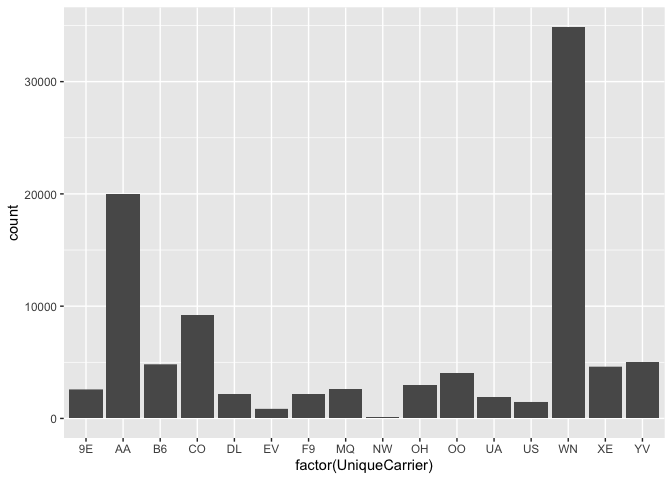 ### \[Ans.
SouthWest {WN} Airlines \]

## Destination with the maximum number of cancellations

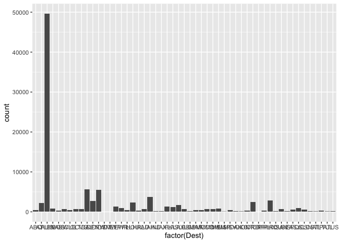 ###
Destinations with the most cancelled flights: Austin (maximum), Dallas,
Houston, Phoenix

## Frequency of Flights

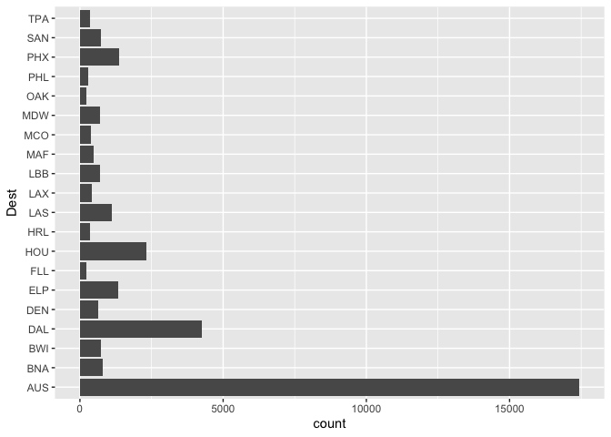

# Question 2: Billboard Top 100

## Part A

    ## # A tibble: 10 × 3
    ## # Groups:   performer [10]
    ##    performer                                 song                                count
    ##    <chr>                                     <chr>                               <int>
    ##  1 Imagine Dragons                           Radioactive                            87
    ##  2 AWOLNATION                                Sail                                   79
    ##  3 Jason Mraz                                I'm Yours                              76
    ##  4 The Weeknd                                Blinding Lights                        76
    ##  5 LeAnn Rimes                               How Do I Live                          69
    ##  6 LMFAO Featuring Lauren Bennett & GoonRock Party Rock Anthem                      68
    ##  7 OneRepublic                               Counting Stars                         68
    ##  8 Adele                                     Rolling In The Deep                    65
    ##  9 Jewel                                     Foolish Games/You Were Meant For Me    65
    ## 10 Carrie Underwood                          Before He Cheats                       64

###Caption: # This table ranks the 10 most popular songs from 1958 to
2021 # (as measured by the number of weeks that each song spent on the
Billboard Top 100 chart).

## Part B

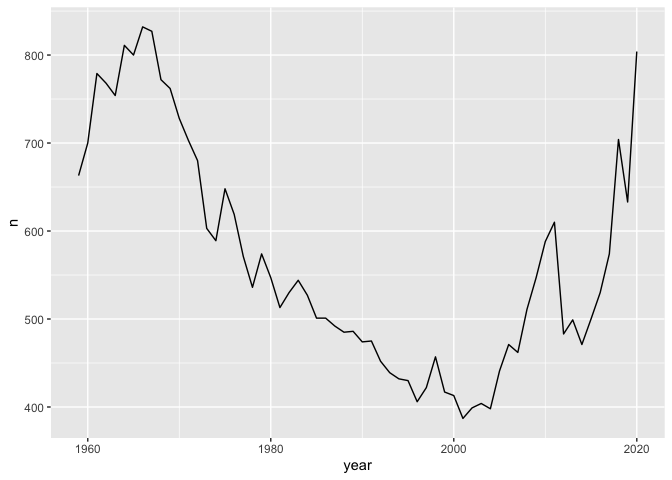 ###
Caption: Number of songs appearing in the Top 100 per year ###
Interesting trend: Overall rise in no. of hits in the sixties followed
by a sharp andsteady decline till the early 2000s. ### Sharp rise in the
number of hits post 2015.

## Part C

    ## `summarise()` has grouped output by 'song_id'. You can override using the `.groups` argument.

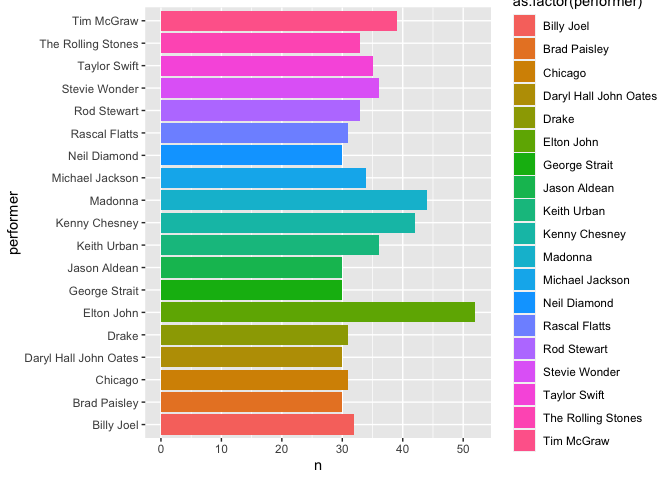

# Question 3: Olympics

## Part A

### I’ve labelled the filtered set of female competitors as FC.

    ## 95% 
    ## 186

### Ans: 186

## Part B

    ## # A tibble: 132 × 2
    ##    event                                 sd_height
    ##    <chr>                                     <dbl>
    ##  1 Rowing Women's Coxed Fours                10.9 
    ##  2 Basketball Women's Basketball              9.70
    ##  3 Rowing Women's Coxed Quadruple Sculls      9.25
    ##  4 Rowing Women's Coxed Eights                8.74
    ##  5 Swimming Women's 100 metres Butterfly      8.13
    ##  6 Volleyball Women's Volleyball              8.10
    ##  7 Gymnastics Women's Uneven Bars             8.02
    ##  8 Shooting Women's Double Trap               7.83
    ##  9 Cycling Women's Keirin                     7.76
    ## 10 Swimming Women's 400 metres Freestyle      7.62
    ## # … with 122 more rows

### Ans: Rowing Women’s Coxed Fours (S.D. : 10.9 {10.86 rounded off to 10.9})

## Part C

    ## `summarise()` has grouped output by 'year'. You can override using the `.groups` argument.

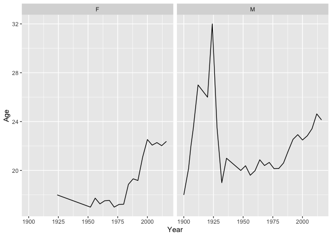 ### The
average age of swimmers has changed over time (sharp rise followed by
fall, then followed by a gradual increase in age). ### For Females:
Overall, the average age dipped around 1975 and has since greatly
increased. ### For Males: Overall, the average age had fallen. It was at
an all-time high around 1921 ### and then fell sharply before gradually
rising (slightly).

# Question 4: S-Class

## For the 350 model trim (labelled TFM)

    #Question 4: S-Class Final Code #

    sclass = read.csv('/Users/rajsitee/Downloads/sclass.csv')

    ## FOR THE 350 MODEL TRIM ##

    # Filter 350 model 
    # Label 350 model as TFM
    TFM <- filter(sclass, trim=="350")
    #view(TFM)

    summary(TFM)

    ##        id            trim             subTrim           condition          isOneOwner           mileage      
    ##  Min.   :  282   Length:416         Length:416         Length:416         Length:416         Min.   :     6  
    ##  1st Qu.:14290   Class :character   Class :character   Class :character   Class :character   1st Qu.: 19264  
    ##  Median :26658   Mode  :character   Mode  :character   Mode  :character   Mode  :character   Median : 29998  
    ##  Mean   :26520                                                                               Mean   : 42926  
    ##  3rd Qu.:39599                                                                               3rd Qu.: 63479  
    ##  Max.   :52220                                                                               Max.   :173000  
    ##       year         color           displacement           fuel              state              region         
    ##  Min.   :1994   Length:416         Length:416         Length:416         Length:416         Length:416        
    ##  1st Qu.:2006   Class :character   Class :character   Class :character   Class :character   Class :character  
    ##  Median :2012   Mode  :character   Mode  :character   Mode  :character   Mode  :character   Mode  :character  
    ##  Mean   :2010                                                                                                 
    ##  3rd Qu.:2012                                                                                                 
    ##  Max.   :2013                                                                                                 
    ##  soundSystem         wheelType          wheelSize          featureCount        price       
    ##  Length:416         Length:416         Length:416         Min.   :  0.00   Min.   :  6600  
    ##  Class :character   Class :character   Class :character   1st Qu.: 31.75   1st Qu.: 19401  
    ##  Mode  :character   Mode  :character   Mode  :character   Median : 54.00   Median : 52900  
    ##                                                           Mean   : 49.22   Mean   : 46854  
    ##                                                           3rd Qu.: 70.00   3rd Qu.: 61991  
    ##                                                           Max.   :112.00   Max.   :106010

### RMSE Plot for the 63 AMG Trim

### Optimal K: 11

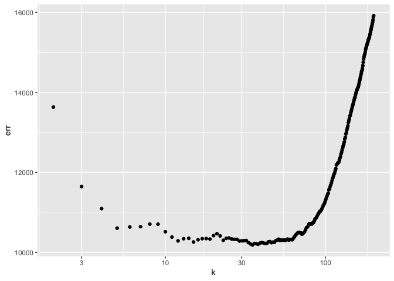

    ## [1] 35

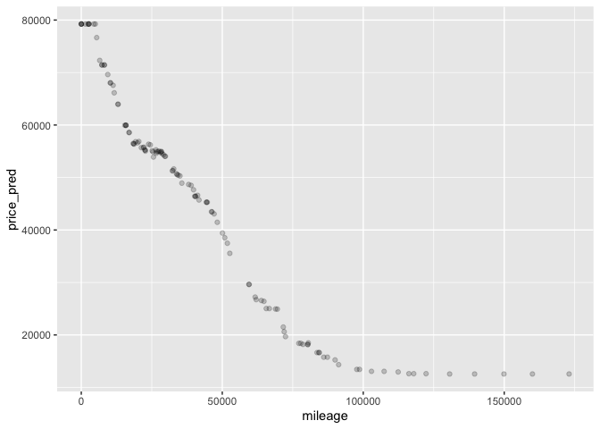 # Fitted
plot for the 350 model trim
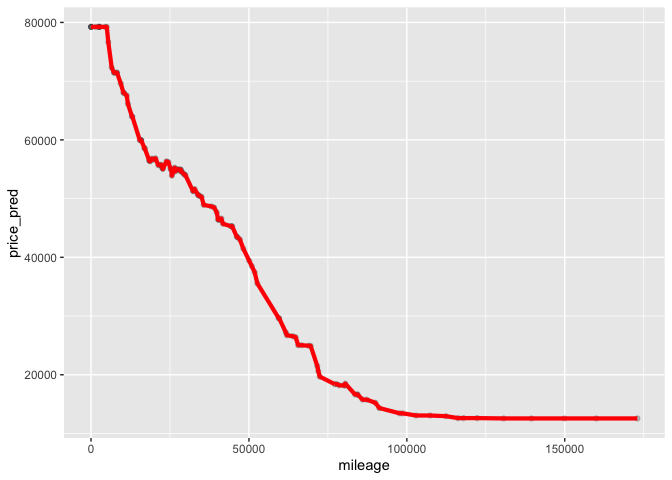 ## For the
63 AMG Trim

    ##        id            trim             subTrim           condition          isOneOwner           mileage      
    ##  Min.   :  172   Length:1413        Length:1413        Length:1413        Length:1413        Min.   :     1  
    ##  1st Qu.:12809   Class :character   Class :character   Class :character   Class :character   1st Qu.:    12  
    ##  Median :25863   Mode  :character   Mode  :character   Mode  :character   Mode  :character   Median :    60  
    ##  Mean   :26087                                                                               Mean   : 19354  
    ##  3rd Qu.:38679                                                                               3rd Qu.: 36083  
    ##  Max.   :52323                                                                               Max.   :147851  
    ##       year         color           displacement           fuel              state              region         
    ##  Min.   :2008   Length:1413        Length:1413        Length:1413        Length:1413        Length:1413       
    ##  1st Qu.:2010   Class :character   Class :character   Class :character   Class :character   Class :character  
    ##  Median :2014   Mode  :character   Mode  :character   Mode  :character   Mode  :character   Mode  :character  
    ##  Mean   :2013                                                                                                 
    ##  3rd Qu.:2015                                                                                                 
    ##  Max.   :2015                                                                                                 
    ##  soundSystem         wheelType          wheelSize          featureCount        price       
    ##  Length:1413        Length:1413        Length:1413        Min.   :  0.00   Min.   : 23990  
    ##  Class :character   Class :character   Class :character   1st Qu.: 14.00   1st Qu.: 62995  
    ##  Mode  :character   Mode  :character   Mode  :character   Median : 57.00   Median :150735  
    ##                                                           Mean   : 47.48   Mean   :119549  
    ##                                                           3rd Qu.: 75.00   3rd Qu.:163055  
    ##                                                           Max.   :119.00   Max.   :251025

### RMSE plot for the 63AMG trim

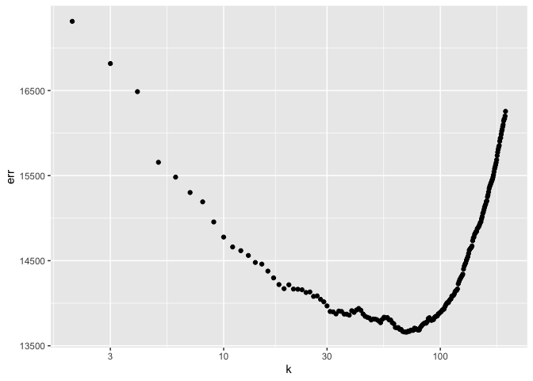

    ## [1] 70

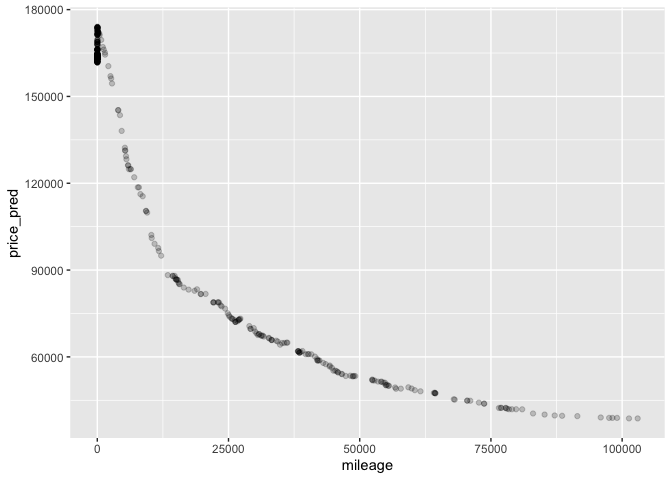

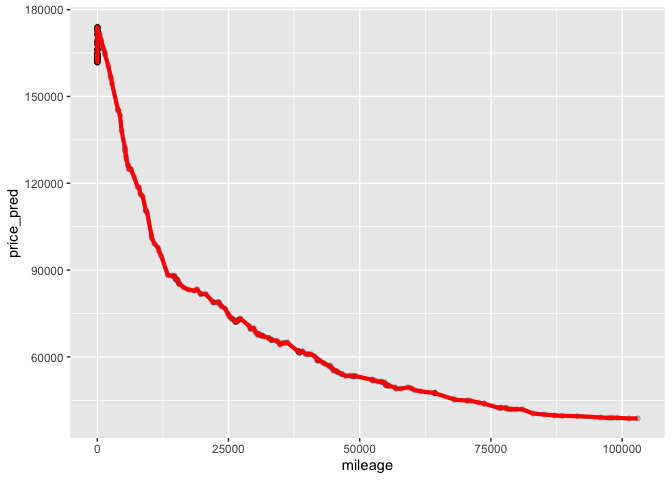 ###
Usually, higher values of k reduce variation in the model but lead to
greater bias (bias-variance tradeoff). Here we see that with repeated
trails, the k value for the 63 model is higher because that trim has a
larger sample size. When the sample size is large, you can use a larger
k as the values will have a lower effect on the bias in the model.
